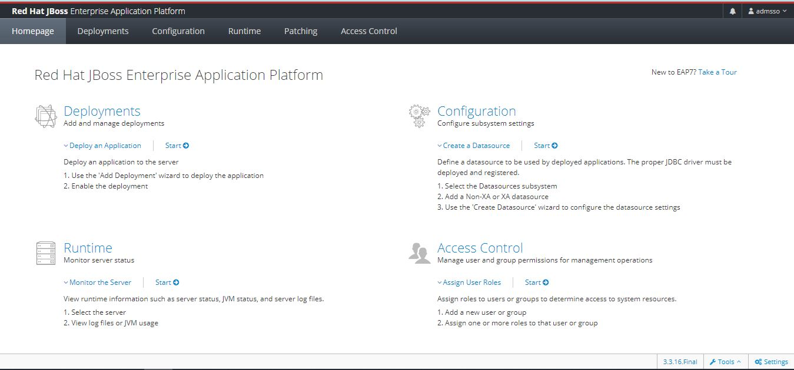

## Install Red Hat Single Sign-On 7.6 - Standalone - RHEL 8.8

### Step 01) Install openjdk and openjdk-devel 
Install OpenJDK
```sh
dnf install java-11-openjdk java-11-openjdk-devel -y
```

### Step 02) Download the Red Hat Single Sign-On 7.6 server and Red Hat Single Sign-On 7.6.3 server patch
```sh
#.../files/
cd /opt
rh-sso-7.6.0-server-dist.zip
rh-sso-7.6.3-patch.zip
```

### Step 03) Installing RH-SSO from a ZIP file
```sh
cd /opt
unzip rh-sso-7.6.0-server-dist.zip
cd rh-sso-7.6/bin
```

### Step 03) Apply the patch
```sh
cd /opt/rh-sso-7.6/bin
sh jboss-cli.sh
```
```sh
patch apply /opt/rh-sso-7.6.3-patch.zip
```
```sh
quit
```

### Step 04) Create user
```sh
useradd jboss-eap
chown -R jboss-eap:jboss-eap /opt/rh-sso-7.6
```

### Step 05) Start service RH-SSO
```sh
cd /opt/rh-sso-7.6/bin/init.d/
```
```sh
vim jboss-eap.conf
```
```sh
## Location of JBoss EAP
JBOSS_HOME="/opt/rh-sso-7.6"

## The username who should own the process.
JBOSS_USER=jboss-eap

## The mode JBoss EAP should start, standalone or domain
JBOSS_MODE=standalone

## Configuration for standalone mode
JBOSS_CONFIG=standalone.xml

## Location to keep the console log
JBOSS_CONSOLE_LOG="/var/log/jboss-eap/console.log"

## Additionals args to include in startup
JBOSS_OPTS="-b 0.0.0.0"
```
Copy files:
```sh
cp jboss-eap.conf /etc/default/
cp jboss-eap-rhel.sh /etc/init.d/
chmod +x /etc/init.d/jboss-eap-rhel.sh
chkconfig --add jboss-eap-rhel.sh
```
Start service RH-SSO
```sh
systemctl start jboss-eap-rhel
systemctl enable jboss-eap-rhel
systemctl status jboss-eap-rhel
```

### Step 06) Rule firewall
```sh
firewall-cmd --permanent --zone=public --add-port=8080/tcp
firewall-cmd --permanent --zone=public --add-port=9990/tcp
firewall-cmd --reload
firewall-cmd --zone=public --permanent --list-ports
```

### Step 07) Validate service
```sh
Open your browser and go to http://<your-ip>:8080/auth to try it out.
```


### Step 08) Admin Console
```sh
cd /opt/rh-sso-7.6/bin
sh add-user.sh
```
```text
What type of user do you wish to add?
 a) Management User (mgmt-users.properties)
 b) Application User (application-users.properties)
(a):

Enter the details of the new user to add.
Using realm 'ManagementRealm' as discovered from the existing property files.
Username : admsso
Password recommendations are listed below. To modify these restrictions edit the add-user.properties configuration file.
 - The password should be different from the username
 - The password should not be one of the following restricted values {root, admin, administrator}
 - The password should contain at least 8 characters, 1 alphabetic character(s), 1 digit(s), 1 non-alphanumeric symbol(s)
Password :
WFLYDM0102: Password should have at least 1 non-alphanumeric symbol.
Are you sure you want to use the password entered yes/no? yes
Re-enter Password :
What groups do you want this user to belong to? (Please enter a comma separated list, or leave blank for none)[  ]:
About to add user 'admsso' for realm 'ManagementRealm'
Is this correct yes/no? yes
Added user 'admsso' to file '/opt/rh-sso-7.6/standalone/configuration/mgmt-users.properties'
Added user 'admsso' to file '/opt/rh-sso-7.6/domain/configuration/mgmt-users.properties'
Added user 'admsso' with groups  to file '/opt/rh-sso-7.6/standalone/configuration/mgmt-groups.properties'
Added user 'admsso' with groups  to file '/opt/rh-sso-7.6/domain/configuration/mgmt-groups.properties'
Is this new user going to be used for one AS process to connect to another AS process?
e.g. for a slave host controller connecting to the master or for a Remoting connection for server to server Jakarta Enterprise Beans calls.
yes/no? yes
To represent the user add the following to the server-identities definition <secret value="NGRtMW5TUzA=" />

```
Edit file configuration
```sh
vim /opt/rh-sso-7.6/standalone/configuration/standalone.xml
```
```txt
<interface name="management">
    <inet-address value="${jboss.bind.address.management:0.0.0.0}"/>
</interface>
```
```sh
Open your browser and go to http://<your-ip>:9990/ to try it out.
```


### Step 09) Administration Console RH-SSO
cd /opt/rh-sso-7.6/bin
```sh
 ./add-user-keycloak.sh -r master -u usuario -p password
```
```sh
Open your browser and go to http://<your-ip>:8080/auth/ to try it out.
```


## By

[Rolly V.](https://www.linkedin.com/in/rolly-s-villegas-delgado-aa9b9563/)
